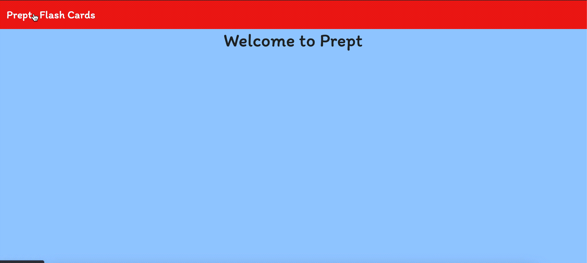

# Prept
> Prept is a flip card application created to help Nashville Software students practice building in React. 
 

## Deployed Site
https://prept.netlify.app

### How to Use

- This project was bootstrapped with [Create React App](https://github.com/facebook/create-react-app).
- Users can create a json file or upload CSV file of answers/questions to firebase database.
- Issue tickets were created for students to complete after the lecture.
